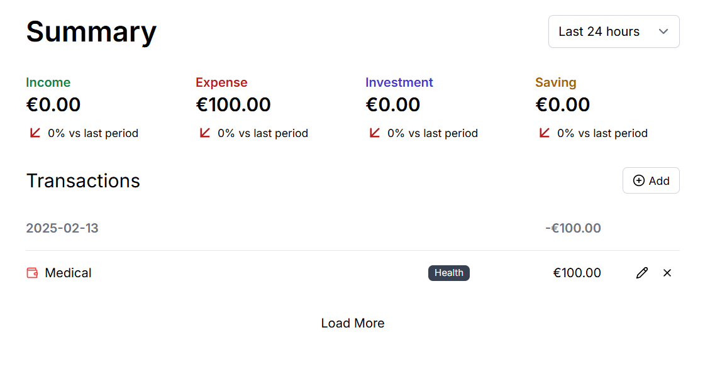
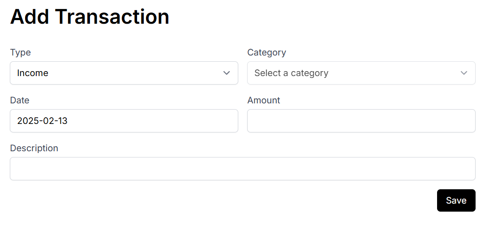
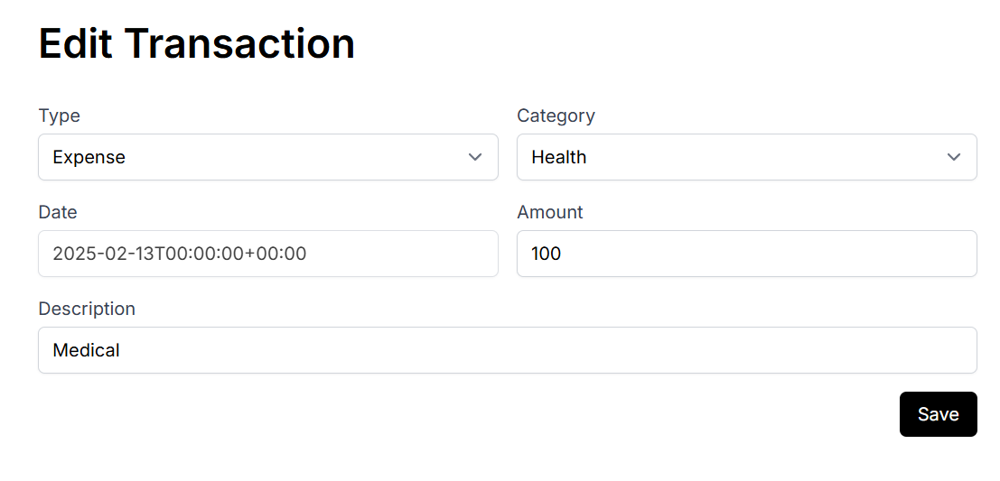
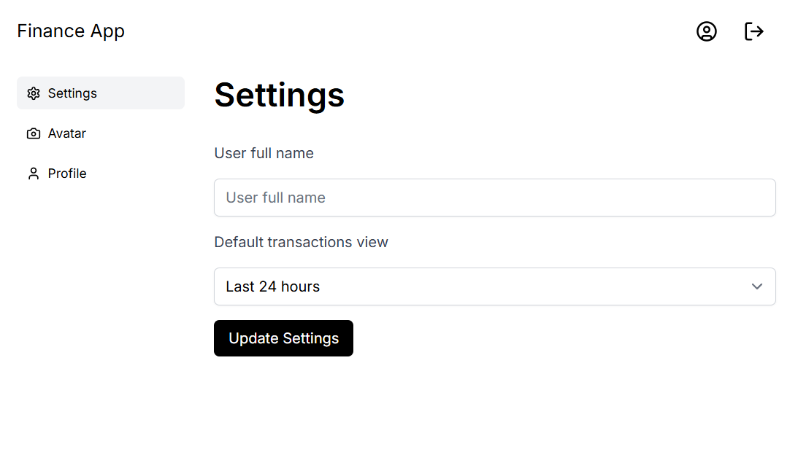
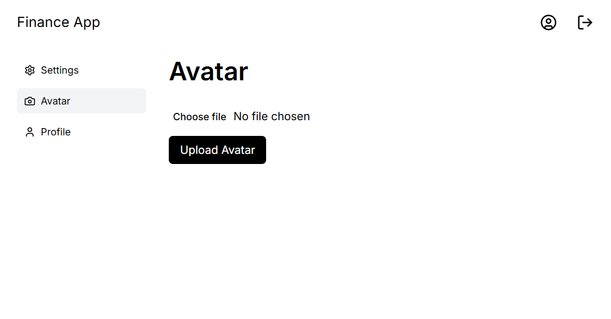

# 💰 TrackMySpend

TrackMySpend is a **finance tracking app** built with **Next.js** and **Supabase**. It allows users to manage their expenses efficiently with real-time database updates, authentication via Magic Link, and custom filtering.

## 🚀 Features

- 🛠 **Authentication with Supabase Magic Link**
- 📊 **Add, Edit, and Delete financial transactions**
- 🏦 **PostgreSQL database (via Supabase)**
- 🔍 **Filters transactions by last 24 days, last 7 days, last 30 days, last 12 months**
- 📝 **Input validation for all fields**
- 🖼 **User profile with avatar upload (Supabase Bucket)**
- ⚡ **Fast and real-time queries with Supabase**
- 🎯 **Set a default dashboard view preference**

## 🛠 Tech Stack

- **Frontend:** Next.js, React, Tailwind CSS
- **Backend:** Supabase (PostgreSQL, Auth, Storage)
- **Database:** PostgreSQL (via Supabase)

## 📸 Project Screenshots

🏠 Dashboard
Displays recent transactions, filters, and total balance.

 

 

📑 Add Transaction
Form with input validation to add a new financial transaction.

 

 

📑 Edit Transaction
Form with input validation to add a new financial transaction.
 

 

👤 Profile Settings
User profile section where users can update their avatar.

 

 

 
